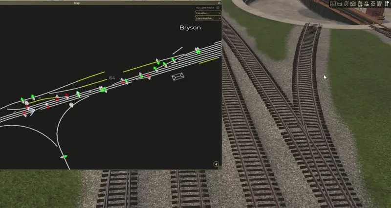
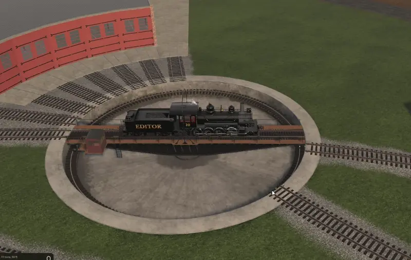

# Collection of all my mods for game Railroader

## MapEditor
Alpha version of Editor

## SwitchNormalizer
A straightforward mod that adds button to normalize all switches on entire map.

Alt mode: when button clicked with SHIFT key it will save current switch state so you can have some switches thrown by default.

## Teleporter 

A straightforward mod that introduces a window for saving teleport locations on the map, enabling quick and convenient navigation across the map.

## TurntableControl

A straightforward mod that allows player to rotate turntable by clicking on track node.
(Known issue: rotation is instant and do not check fouling track)

## Project Setup

In order to get going with this, follow the following steps:

1. Clone the repo
2. Copy the `Paths.user.example` to `Paths.user`, open the new `Paths.user` and set the `<GameDir>` to your game's directory.
3. Open the Solution
4. You're ready!

### During Development

Make sure you're using the _Debug_ configuration. Every time you build your project, the files will be copied to your Mods folder and you can immediately start the game to test it.

### Publishing

Make sure you're using the _Release_ configuration. The build pipeline will then automatically do a few things:

1. Makes sure it's a proper release build without debug symbols
1. Replaces `$(AssemblyVersion)` in the `Definition.json` with the actual assembly version.
1. Copies all build outputs into a zip file inside `bin` with a ready-to-extract structure inside, named like the project they belonged to and the version of it.
